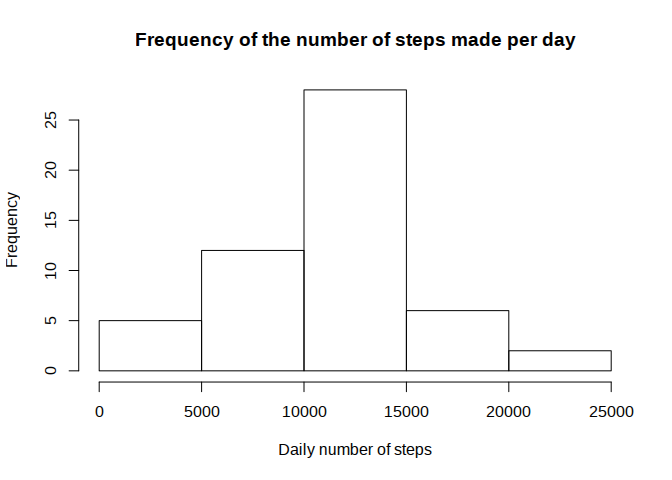
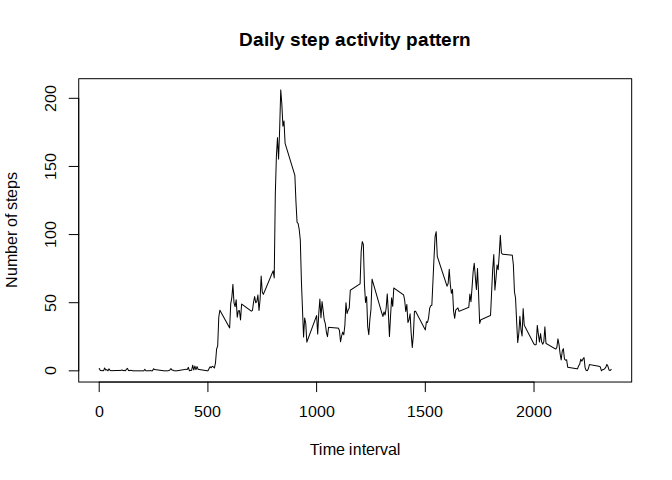
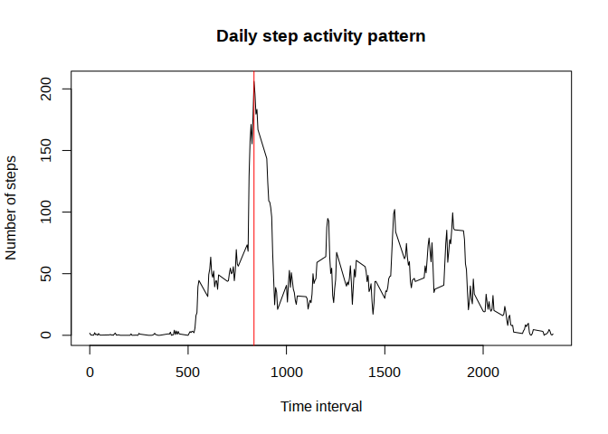
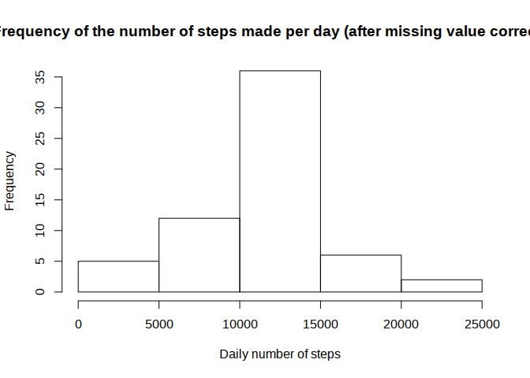
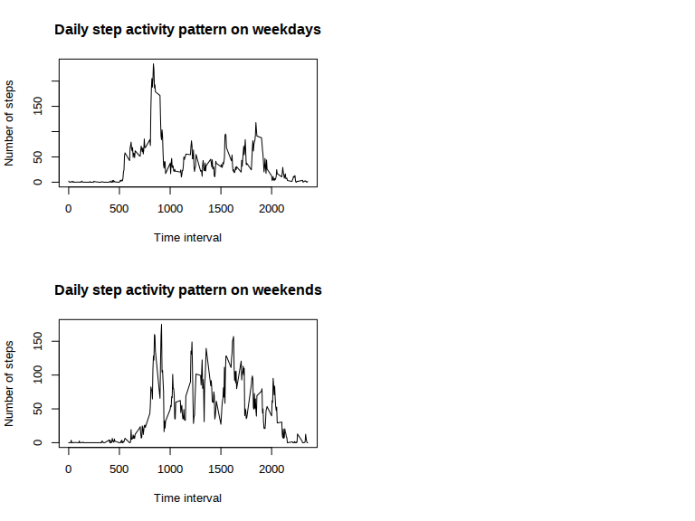

# Reproducible Research: Peer Assessment 1


## Loading and preprocessing the data
To begin with, the code will load all the library required. Then, the next step will focus on opening the .csv file and convert it into a data frame named "df" for further processing. Please note that the code assumes the "activity.csv" file is located in the working directory.


```r
library(lubridate);
df <- read.csv("activity.csv");
```


## What is mean total number of steps taken per day?

This question can be handled by breaking it up into two parts. Firstly, the total steps per day shall be worked out. 

The oode defined the "per_day" variable, in which is stored a data frame with each date in the first variable and the corresponding daily total number of step in the second. 

To do so, the "aggregate" function is applied on the df dataframe, and the code assigns relevant names to the variable with "colnames".


```r
per_day <- aggregate(df$step, list(df$date), sum);
colnames(per_day) <- c("date","steps")
```

In order to visualize this set of data, the code generates an histogram representing the frequency of the daily number of steps within the "per_day" data frame.


```r
hist(per_day$steps, xlab = "Daily number of steps", main="Frequency of the number of steps made per day");
```

 

The last part of the question is then tackled by defining the two variables "per_day_mean" and "per_day_median", to which are assigned respectively the results of the mean and median function applied to the steps variable of the per_day data frame.


```r
per_day_mean <- mean(per_day$steps, na.rm = TRUE);
per_day_median <- median(per_day$steps, na.rm = TRUE);
```

We ge the following value:


```r
print(per_day_mean)
```

```
## [1] 10766.19
```

```r
print(per_day_median)
```

```
## [1] 10765
```

It appear thus that the data show an average of about 10,000 steps a day, which is confirmed by a close median.


## What is the average daily activity pattern?

The question focuses on the average number of step recorded for each 5 minute period in a day, based on all the daily record that we have.

Similarly to the first question, we can aggregate all the data for each 5-minutes interval that have been recorded. The idea here is to create an average of all the numbers of steps measured for each 5-minutes interval. The "per_interval" variable will include the average steps numbers covering all the time period of a day.


```r
per_interval <- aggregate(df$steps, list(df$interval), mean, na.rm=TRUE);
colnames(per_interval) <- c("interval", "steps");
```

The aggregate function does not change much from the first question, as the code only calculate an average of steps instead of a sum of steps this time. 


```r
plot(per_interval$interval, per_interval$steps, type="l", xlab="Time interval", ylab="Number of steps", main="Daily step activity pattern");
```

 

The plot above clearly show a typical spike of activity around 8am. Let's try to work this value out, by defining a "high_step_value" variable that will take the maximum value in the "per_interval" dataframe and represent it on the plot by a red line.


```r
high_step_interval <- per_interval[which(per_interval$steps == max(per_interval$steps)), 1]
plot(per_interval$interval, per_interval$steps, type="l", xlab="Time interval", ylab="Number of steps", main="Daily step activity pattern");
abline(v=high_step_interval, col="red")
```

 

```r
print(high_step_interval)
```

```
## [1] 835
```

The subject of these measurements walks the most around 8.35AM


## Imputing missing values

The given data set seems to be clotted with missing value. If we were to replace them, we would have to pick a strategy in order to minimize the impact of the data.

We can start by giving a rough idea of the proportion of missing values within the data set. In order to do so, we can summarize the logical vector returned by the is.na() funtion applied to the step variable.


```r
NA_count <- sum(is.na(df$steps))
```

We count 2304 missing values among the "steps" variable. We can thus imagine that they represent a sizable part of the 17568 observation present in the data set.

One way to replace these missing value would be to use the average value calculated for each 5-minutes segment in the previous question. The influence on the data would be lessened as adding average value would not increase the disperion of the distribution. Beside, the "per_interval" variable does not include any missing value either.

The first step consist in defining a new data set, "nonas_steps", as copy of the initial steps column of the "df" dataframe. Then,the code checks whether there are any missing value and replaces it with the average values from the "per_interval" data frame.


```r
nonas_steps <- ifelse(is.na(df$steps), per_interval$steps, df$steps)
```

Then, the code recreates another version of the original data set, "nonas_df", with the new variable separated from the missing value.


```r
nonas_df <- df
nonas_df$steps <- nonas_steps
```

It possible from here to recreate the calculation required in the first part of the assignment, only using the nonas-prefixed data frame as below, and recreating the same variable with the nonas prefix.


```r
nonas_per_day <- aggregate(nonas_df$step, list(nonas_df$date), sum);
colnames(nonas_per_day) <- c("date","steps");

hist(nonas_per_day$steps,xlab = "Daily number of steps", main="Frequency of the number of steps made per day (after missing value correction)");
```

 

```r
nonas_per_day_mean <- mean(per_day$steps, na.rm = TRUE);
nonas_per_day_median <- median(per_day$steps, na.rm = TRUE);
print(nonas_per_day_mean);
```

```
## [1] 10766.19
```

```r
print(nonas_per_day_mean);
```

```
## [1] 10766.19
```

The missing value, following the strategy chosen above, does not seem to impact the data in a significant way, considering the new mean and median that came out as identical as earlier.


## Are there differences in activity patterns between weekdays and weekends?

The question raise the necessity to separate the observations, between those measured during the week and those measured during the weekend. 

To do so,  the function "isWeekEnd" has been defined to take a date into argument and return a factor, "weekday" or "weekend", using the wday() function of the lubridate package that return the weekday of a date.


```r
isWeekend <- function(date){
  ifelse(wday(date) == 7 || wday(date) == 1, return(factor("weekend")), return(factor("weekday")))
}
```


Once the function defined, the code applies this function to the "date" column of the original dataset, to create an new variable. This variable "weekend" is then bound to the data.


```r
weekend <- sapply(df$date, isWeekend)
we_df <- cbind(df, weekend);
```


From here, the code splits the resulting we_df dataframe into two lists of observations according the weekend variable and creates two distinct data frames, "wday"" for the week days measurements and "wend" for the weekend ones.

The same processing as in the second question is applied afterwards to obtain the daily step pattern on week days and week end, stored respectively in the "wd_per_interval" and "we_per_interval" variables.


```r
we_df <- split(we_df, we_df$weekend)

wday_df <- as.data.frame(we_df[1])
wend_df <- as.data.frame(we_df[2])

wd_per_interval <- aggregate(wday_df$weekday.steps, list(wday_df$weekday.interval), mean, na.rm=TRUE)
colnames(wd_per_interval) <- c("interval", "steps")

we_per_interval <- aggregate(wend_df$weekend.steps, list(wend_df$weekend.interval), mean, na.rm=TRUE)
colnames(we_per_interval) <- c("interval","steps")
```

These variables can be translated graphically to observe the difference in walking patterns during the week and on weekends. 


```r
par(mfcol=c(2,2))

plot(wd_per_interval$interval, wd_per_interval$steps, type="l", xlab="Time interval", ylab="Number of steps", main="Daily step activity pattern on weekdays");

plot(we_per_interval$interval, we_per_interval$steps, type="l", xlab="Time interval", ylab="Number of steps", main="Daily step activity pattern on weekends");
```

 

The resulting plots show that the steps are more spread during the day on weekend than during the week. Week days see their own pattern consisting in a high peak early in the morning, while the rest of the day tend to be quieter.
